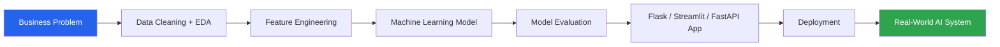

<div align="center">


<br>

<a href="https://git.io/typing-svg">
  
</a>

<br>

[](https://stud-huzaifa.github.io/huzaifa-portfolio/)
[](https://www.linkedin.com/in/muhammad-huzaifa-271900242/)
[](https://github.com/Stud-Huzaifa)
[](mailto:your-email@example.com)

<br>


<br><br>


</div>

<br>

## 👨‍💻 About Me

<div align="center">

> 💭 *"I take a business problem, clean the data, build the model, evaluate it honestly, and ship it as something people can actually use."*

</div>

<table>
<tr>
<td width="60%" valign="top">

- 🎓 BS Data Science student at **Dawood University of Engineering & Technology**
- 🧠 Focused on Machine Learning, Predictive Modeling, and AI-powered systems
- 🛠️ Working with Python, Scikit-learn, Flask, Streamlit, FastAPI, SQL, and React
- 📊 Building churn prediction, invoice intelligence, AQI forecasting, and risk detection systems
- 🚀 Learning full ML workflows — from raw data to deployment
- 🤝 Open to internships, junior data roles, freelance ML work, and remote collaboration
- 💬 Ask me about **model evaluation, feature engineering, or deploying ML apps**
- ⚡ Fun fact: I'd rather debug a model at 2 AM than leave a bug unsolved

</td>
<td width="40%" align="center">


</td>
</tr>
</table>

<div align="center">


</div>

## 📈 Skill Proficiency

<div align="center">

**Python**


**Machine Learning (Scikit-learn)**


**Data Analysis (Pandas / NumPy / SQL)**


**Flask / Streamlit / FastAPI**


**Data Visualization**


**React (Frontend for ML apps)**


</div>


## 🧱 Tech Stack

<div align="center">

**Languages & Data**


<br><br>


**Apps & Deployment**


</div>

## 🚀 Featured Projects

<div align="center">

</div>

<table>
<tr>
<td width="50%" valign="top">

### 🔮 Customer Churn Prediction App
Identifies customers likely to leave and prioritizes retention actions with a risk-segmented, deployed ML app.

  

[](https://sarah-ahmed-client-1.onrender.com/)
[](https://github.com/Stud-Huzaifa/customer-churn-app-retention-bussiness-intelligent-system)

</td>
<td width="50%" valign="top">

### 🧾 Vendor Invoice Intelligence Portal
Predicts freight cost and screens invoices for approval risk to support finance & procurement teams.

 

[](https://invoice-intelligence-machine-learning-project-h8pmxm4koinppmh8.streamlit.app/)
[](https://github.com/Stud-Huzaifa/Invoice-Intelligence-Machine-Learning-Project)

</td>
</tr>
<tr>
<td width="50%" valign="top">

### 🌫️ AirSense AI
Full-stack platform that monitors air quality, predicts AQI trends, and delivers health-risk guidance on a live map.

 

[](https://stud-huzaifa.github.io/huzaifa-portfolio/)

</td>
<td width="50%" valign="top">

### 📈 NVIDIA Stock Price Prediction
Predicts next-day NVIDIA stock price using regression on historical market data.

  

[](https://github.com/Stud-Huzaifa/nvidia-stock-prediction)

</td>
</tr>
<tr>
<td width="50%" valign="top">

### 🩺 Breast Cancer Prediction Web App
Classifies cancerous vs non-cancerous cases using a trained ML classification model served through Flask.

 

[](https://github.com/Stud-Huzaifa/Breast-Cancer-Prediction)

</td>
<td width="50%" valign="top">

### ✨ More on the way
New end-to-end ML systems are always in progress — the portfolio always has the freshest work.


[](https://stud-huzaifa.github.io/huzaifa-portfolio/)

</td>
</tr>
</table>


## 🔍 Project Highlights

<details>
<summary><b>🔮 Customer Churn Prediction & Retention Intelligence App</b></summary>
<br>

A deployed machine learning app that predicts customer churn and segments customers by risk level.

**Key Features:** CSV upload · Data validation · Churn probability prediction · Risk segmentation · Monitoring dashboard · Downloadable results

**Why it matters:** Businesses can spot at-risk customers earlier and act on retention before it's too late.
</details>

<details>
<summary><b>🧾 Vendor Invoice Intelligence Portal</b></summary>
<br>

A finance-focused machine learning app for invoice approval risk and freight cost prediction.

**Key Features:** Freight cost prediction · Invoice risk screening · Structured input workflow · Business insight cards · Interactive dashboard

**Why it matters:** Cuts down manual invoice checking and speeds up approval decisions.
</details>

<details>
<summary><b>🌫️ AirSense AI</b></summary>
<br>

A full-stack AQI monitoring and prediction platform built for environmental intelligence.

**Key Features:** Live AQI data workflow · Pollutant trend visualization · AQI prediction · Health-risk alerts · Map-based air quality view · Rule-based assistant

**Why it matters:** Turns raw air quality readings into insights people can act on for safer outdoor decisions.
</details>

## 💭 Random Dev Quote

<div align="center">


</div>

## 🧭 My ML Workflow



## 📊 GitHub Analytics

<div align="center">


<br>


<br>


<br><br>


</div>

### 🐍 Live Contribution Snake

<!--
  This animated "snake" eats through your contribution graph and moves in real time.
  One-time setup required — see the note at the bottom of this README.
-->
<div align="center">
<picture>
  <source media="(prefers-color-scheme: dark)" srcset="https://raw.githubusercontent.com/Stud-Huzaifa/Stud-Huzaifa/output/github-contribution-grid-snake-dark.svg">
  <source media="(prefers-color-scheme: light)" srcset="https://raw.githubusercontent.com/Stud-Huzaifa/Stud-Huzaifa/output/github-contribution-grid-snake.svg">
  
</picture>
</div>


## 🏆 Certifications

<div align="center">


</div>

- Python for Data Science & AI
- Tools for Data Science
- Data Visualization with Python
- Databases and SQL for Data Science
- Applied Data Science Capstone


## 🎯 Current Focus

<table>
<tr>
<td width="70%" valign="top">

```text
🔭 Building stronger end-to-end ML projects
🌱 Improving model evaluation and comparison
✍️ Writing better project documentation and case studies
🚢 Deploying ML apps with clean, usable interfaces
📚 Learning practical AI systems and business-focused analytics
💼 Turning portfolio projects into client-ready solutions
```

</td>
<td width="30%" align="center">


</td>
</tr>
</table>

## 🤝 Open To

<div align="center">


</div>

## 📫 Let's Connect

<div align="center">


<br>

<a href="https://stud-huzaifa.github.io/huzaifa-portfolio/"></a>
<a href="https://github.com/Stud-Huzaifa"></a>
<a href="https://www.linkedin.com/in/muhammad-huzaifa-271900242/"></a>
<a href="mailto:your-email@example.com"></a>

<br><br>


</div>
